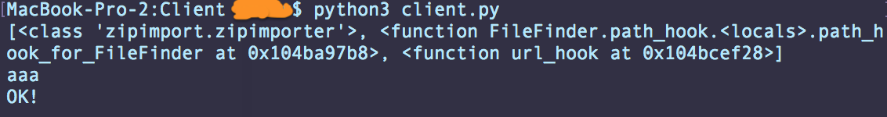

# remoteLoadModulePython

output:

**start server:** python3 -m http.server
  
**start client:** python3 client.py

Как работает:
- мы добавляем в системый путь наш локалхост: sys.path.append("http://localhost:8000")
- Вешаем хук на загрузку модулей: sys.path_hooks.append(url_hook)
- URLLoader и URLFinder позволяют загрузить модуль с PythonServer
